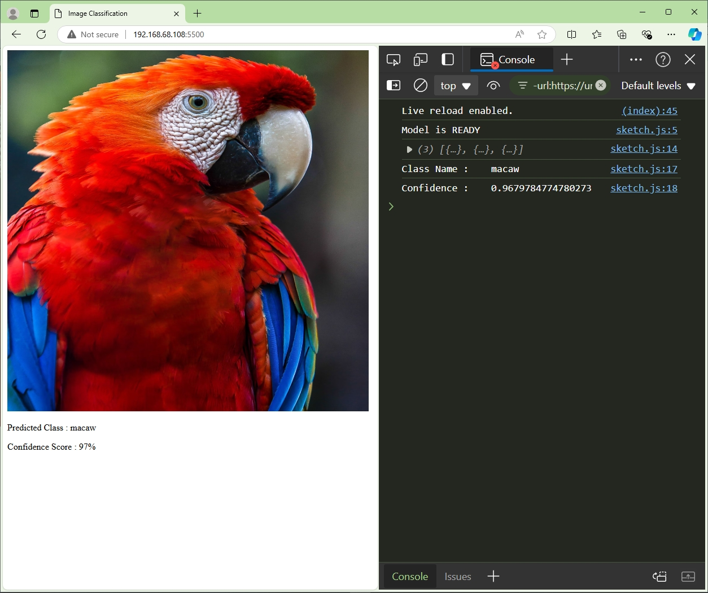

# Machine-Learning-with-Javascript
This is my Javascript journey with Machine Learning using ML5.js and P5.js. I might add some projects and more advanced stuffs in future.

----

  <h2>Weekly Progress:</h2>

<h3>Week-01 :</h3>   

