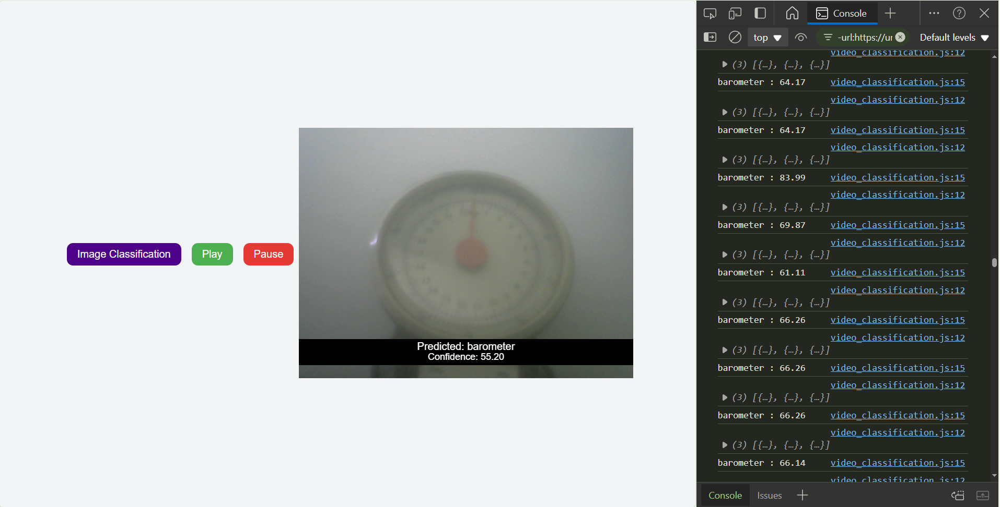

# Machine-Learning-with-Javascript
This is my Javascript journey with Machine Learning using ML5.js and P5.js. I might add some projects and more advanced stuffs in future.

----

  <h2>Weekly Progress:</h2>

<h3>Week-01 :</h3>   

Learnt how to use MobileNet to classify any image.  Console output manipulation, results showing on the page.

 
<h3>Week-02 :</h3>   

Using ml5.js text formatting and conditional color change on confidence score threshold. Changing prediction box color on level of confidence.

 
Real-time webcam video object classification with Play and Pause button conditions.

